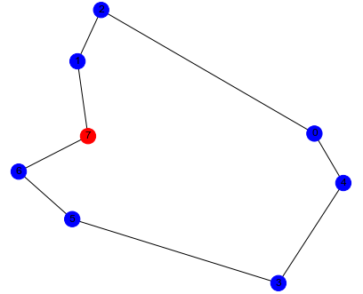
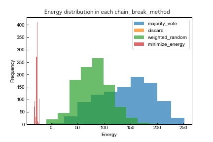
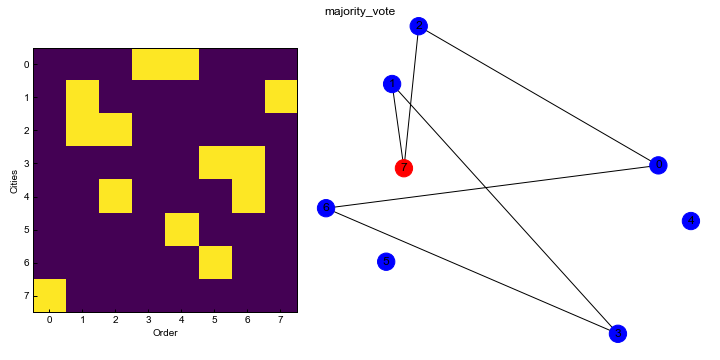
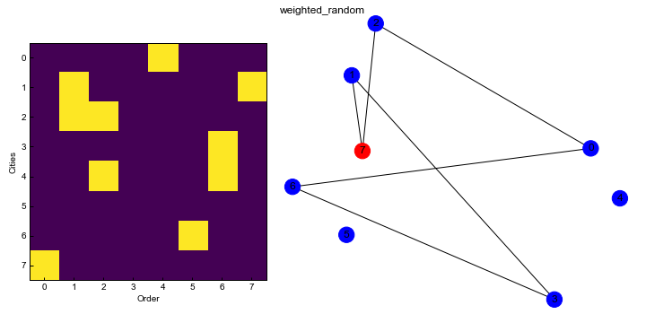
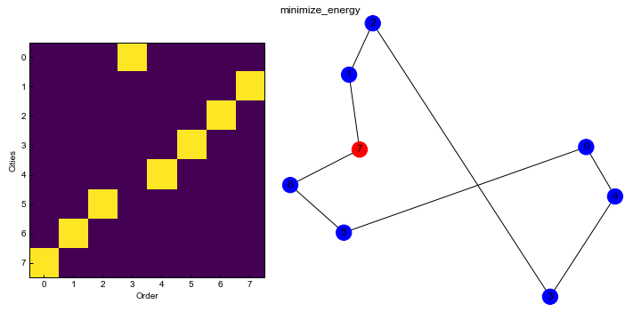

# Solving a Traveling Salesperson Problem by QPU

A demo on using the D-Wave Ocean SDK to solve the Traveling Salesperson Problem (TSP) and comparing differences in performance of solutions due to post-processing. 
TSP is the problem of finding the shortest route for a salesperson to visit all given cities once and return to the starting city.



In the figure above, the origin city is shown in red and the others are in blue.
The lines represent the route of travel .

We use D-Wave QPU solver, DW_2000Q_5, to solve this problem.
In this demo, you can see the differences in the properties of the solutions depending on post-processing applied to the samples obtained from the solver.


Usage
-----

A simple command that runs the demo. For example,

```
python traveling-salesperson-problem.py
```


Code Overview
-------------

To solve this problem, we should express the problem with a cost function in the QUBO format.
The cost function represents total travel distance on a route and also there are two constraints to be satisfied shown below:

1. Visit all cities once
2. Visit only one city at the same time

Using [`PyQUBO`](https://pyqubo.readthedocs.io/en/latest/), the cost function including these constraints can get converted to a QUBO matrix.

In this demo, samples returned from the solver need post-processing.
We use [`Chain-Break Resolution`](https://docs.ocean.dwavesys.com/projects/system/en/stable/reference/embedding.html#chain-break-resolution) and resolve broken chains and unembed the samples (this operation is called post-processing).
Chain-Break Resolution has four methods:

* ``majority_vote``
* ``discard``
* ``weighted_random``
* ``MinimizeEnergy``

We compare unembedded solutions with each method in terms of energy distribution and the rate of constraints satisfied.
For more information on Chain-Break Resolution, please check the link above.


Code Specifics
--------------

### Problem setting

Let N be the number of cities and assign an index from ``0`` to ``N-1`` to each city.
The dictionary ``positions`` has a city index in the key and x, y coordinate of a city in tuple form in the value.
The coordinates of each city are randomly determined in this demo so you can rewrite this dictionary according to the target problem.

Then select the starting city index at random and store it in ``origin``.
You can change the variable contents if necessary.

After describing the problem setting calculate the distances between each city and assign them to the matrix ``distances``.


### Problem formulation

Express the problem in QUBO format by using variables ``q[i][t]`` that take 1 if visiting city with index ``i`` at time ``t``, 0 otherwise.

The first term of ``H_cost`` is  ``exp_origin``, which expresses the distance from the start point to the next city and from the last city to the endpoint.
The second term ``exp_others`` shows the total distance from the current city to the next city.

And also ``H_city`` expresses the first constraint and ``H_time`` states the second constraint.

Therefore, the objective function is represented by ``H_obj`` using normalization function as in the code.


### Solve QUBO and unembed samples

Submit the QUBO to the solver DW_2000Q_5.
For that, we adopt ``minorminer.find_embedding`` to find embedding and embed the QUBO on the solver's graph.
Call ``DWaveSampler.sample_qubo`` to get a response containing samples with broken chains.

We unembed obtained samples by specifying the above methods as an argument ``chain_break_method`` of ``unembed_sampleset``.
Then use ``check_constraint`` function to compute the rate of unembedded solutions satisfying constraints with each method.


### Visualize the result

Visualize the result by Matplotlib package.
First, display the histogram of the energy distribution of unembedded samples in each chain_break_method.

Next, define the function ``show_result`` which plots the traveling order and draws the traveling route from the input solution.
So you can see the result of solutions with the lowest energy in each method.


Result of Comparative Verification
----------------------------------
We considered the random problem in the case of 8 cities, and the following is an example of the result of comparative verification by this demo.
The optimal solution route for this problem is displayed at the beginning of this file.






All raw samples from the solver have broken chains, so we couldn't get any unembedded sample with ``discard``.
Also, no sample satisfying the constraints was obtained for ``majority_vote`` and ``weighted_random``.

But for ``MinimizeEnergy``, several solutions fulfill the constraints.
Looking at the histogram, the energy is much lower and its distribution is narrower than other methods.
However, the lowest sample is not the optimal solution as you can see in the bottom figure.
If you use DW_2000Q_5 and handle problems of the same size as this time, the optimal solution cannot be obtained without much more sampling and using ``MinimizeEnergy`` .


License
-------
Released under the Apache License 2.0. See `LICENSE <LICENSE>`_ file.
